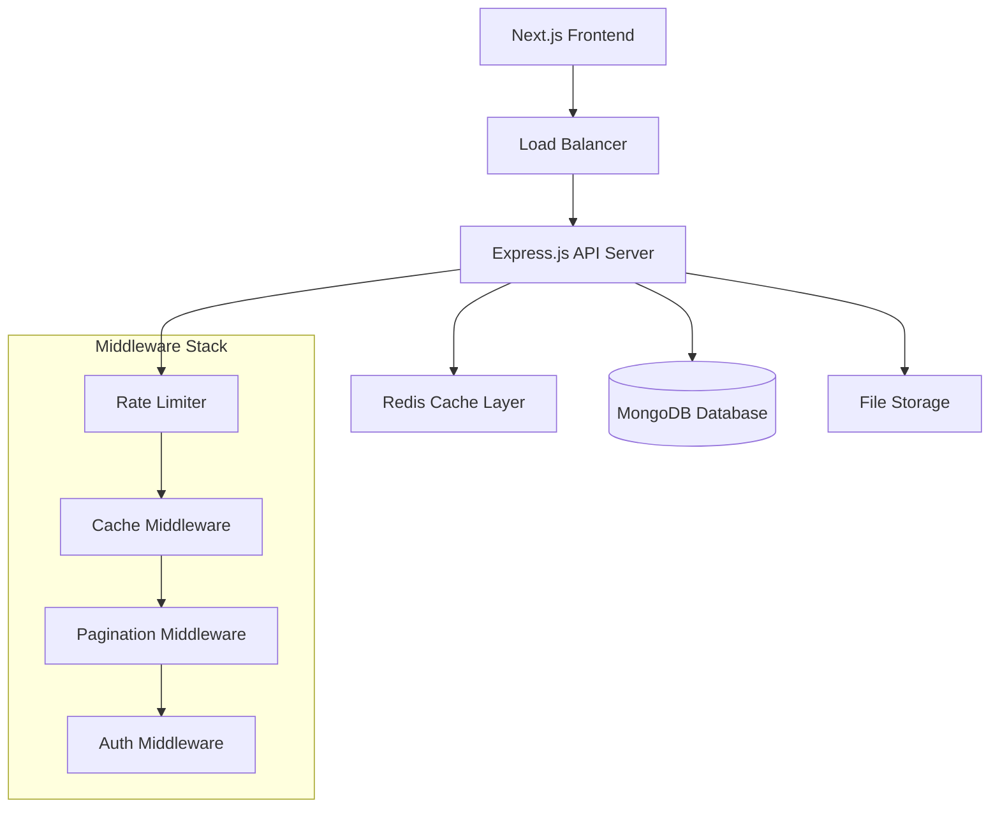

# 🚀 SocialPro - Professional Social Network Platform

SocialPro is a comprehensive social networking platform built for professional networking, featuring real-time messaging, content sharing, connection management, and advanced performance optimizations.

## 📊 Architecture Overview



## 🛠️ Tech Stack

### Backend
- **Runtime**: Node.js with ES Modules
- **Framework**: Express.js 5.1.0
- **Database**: MongoDB with Mongoose ODM
- **Caching**: Redis 4.7.0 with connect-redis
- **Authentication**: JWT (JSON Web Tokens)
- **File Handling**: Multer for multipart uploads
- **Rate Limiting**: express-rate-limit with Redis backend
- **Security**: bcrypt for password hashing

### Frontend  
- **Framework**: Next.js 16.0.4 (App Router)
- **UI Library**: React 19.2.0
- **State Management**: Redux Toolkit 2.11.0
- **Styling**: Tailwind CSS 4
- **Language**: TypeScript 5
- **HTTP Client**: Axios 1.13.2

### Infrastructure & Performance
- **Caching Strategy**: Multi-layer caching with Redis
- **Database Optimization**: Strategic indexing for query performance
- **Pagination**: Cursor-based for real-time feeds, offset-based for static data
- **Rate Limiting**: Distributed rate limiting with Redis backend
- **File Storage**: Local filesystem with multer (production: cloud storage)

## 🏗️ System Architecture

### API Layer (Backend)
```
/backend
├── config/           # Configuration files
│   └── redis.js      # Redis client & cache helpers
├── controllers/      # Business logic controllers
│   ├── user.controller.js     # User management & authentication
│   ├── post.controller.js     # Post CRUD & interactions
│   ├── message.controller.js  # Messaging system
│   ├── notification.controller.js # Notifications
│   └── analytics.controller.js    # Analytics & reporting
├── middleware/       # Express middleware
│   ├── rateLimiter.js    # Rate limiting rules
│   ├── cache.js          # Caching strategies
│   ├── pagination.js     # Pagination utilities
│   └── tokenValidator.js # JWT validation
├── models/           # MongoDB schemas
│   ├── user.models.js        # User data schema
│   ├── profile.models.js     # User profile schema
│   ├── post.models.js        # Post content schema
│   ├── connection.models.js  # User connections
│   ├── message.models.js     # Messages schema
│   ├── comments.models.js    # Post comments
│   └── notification.models.js # Notifications
├── routes/           # API endpoints
│   ├── user.routes.js        # User & profile routes
│   ├── post.routes.js        # Post & comment routes
│   ├── message.routes.js     # Messaging routes
│   ├── notification.routes.js # Notification routes
│   └── analytics.routes.js   # Analytics routes
├── scripts/          # Utility scripts
│   ├── createIndexes.js  # Database indexing
│   └── flushCache.js     # Cache management
└── uploads/          # File storage directory
```

### Frontend Layer
```
/socialpro
├── app/              # Next.js App Router
│   ├── components/   # Reusable UI components
│   ├── connections/  # Connection management pages
│   ├── dashboard/    # Main dashboard
│   ├── discover/     # Content discovery
│   ├── login/        # Authentication
│   ├── messaging/    # Real-time messaging
│   ├── profile/      # User profiles
│   └── styles/       # Component-specific styles
├── pages/            # Legacy pages (profile views)
├── src/
│   ├── config/       # Redux store configuration
│   ├── redux/        # State management
│   │   ├── actions/  # Redux actions
│   │   ├── reducers/ # Redux reducers
│   │   └── middleware/ # Redux middleware
│   └── services/     # API service layer
└── public/           # Static assets
```

## 🚀 Getting Started

### Prerequisites
- Node.js 18+ 
- MongoDB Atlas account or local MongoDB
- Redis (optional, will fallback gracefully)
- Git

### Backend Setup

1. **Clone and navigate to backend**
```bash
git clone <repository-url>
cd SocialPro/backend
```

2. **Install dependencies**
```bash
npm install
```

3. **Environment configuration**
```bash
cp .env.example .env
# Edit .env with your configuration
```

4. **Create database indexes** (Recommended)
```bash
npm run db:index
```

5. **Start development server**
```bash
npm run dev
```

The API server will start on `http://localhost:8080`

### Frontend Setup

1. **Navigate to frontend**
```bash
cd ../socialpro
```

2. **Install dependencies** 
```bash
npm install
```

3. **Start development server**
```bash
npm run dev
```

The frontend will start on `http://localhost:3000`

### Production Setup

#### Database Indexes (Critical for Performance)
```bash
cd backend
npm run db:index
```

#### Redis Setup (Recommended)
For production, set up Redis for optimal caching and rate limiting:
```bash
# Ubuntu/Debian
sudo apt install redis-server

# macOS
brew install redis

# Docker
docker run -d -p 6379:6379 redis:alpine
```

## 📚 API Documentation

### Authentication Endpoints
```http
POST /register         # User registration
POST /login           # User authentication
```

### User Management
```http
GET  /get_user_and_profile          # Get current user profile
POST /user_update                   # Update user information
POST /update_profile                # Update profile data
POST /update_profile_picture        # Upload profile picture
GET  /user/get_all_users           # Get paginated users list
GET  /user/get_profile_username    # Get profile by username
```

### Connection System
```http
POST /user/send_connection_request     # Send connection request
GET  /user/getConnectionRequests       # Get incoming requests (paginated)
POST /user/accept_connection_request   # Accept/reject request
GET  /user/get_all_connections        # Get user connections (paginated)
```

### Content Management
```http
POST /post                    # Create new post (with media support)
GET  /posts                  # Get paginated posts feed  
GET  /posts_by_username      # Get user's posts (paginated)
DELETE /delete_post          # Delete user's post
POST /increment_likes        # Like a post
```

### Comments System
```http
POST /comment_post          # Add comment to post
GET  /get_comments         # Get paginated comments
DELETE /delete_comments    # Delete user's comment
```

### Pagination Parameters
All paginated endpoints support:
- `page`: Page number (default: 1)
- `limit`: Items per page (default: 20, max: 100)
- `cursor`: For real-time feeds (posts, messages)

### Rate Limiting
- **General API**: 100 requests/15 minutes per IP
- **Authentication**: 5 requests/15 minutes per IP
- **File Upload**: 10 uploads/hour per user
- **Post Creation**: 20 posts/hour per user
- **Connection Requests**: 50 requests/day per user

## 💾 Database Schema

### Users Collection
```javascript
{
  _id: ObjectId,
  name: String (required),
  username: String (required, unique),
  email: String (required, unique),
  password: String (required, hashed),
  profilePicture: String (default: 'default.jpeg'),
  active: Boolean (default: true),
  token: String (JWT storage),
  createdAt: Date (default: now)
}
```

### Posts Collection  
```javascript
{
  _id: ObjectId,
  userId: ObjectId (ref: User),
  body: String (required),
  likes: Number (default: 0),
  media: String (filename),
  fileType: String,
  active: Boolean (default: true),
  createdAt: Date (default: now),
  updatedAt: Date (default: now)
}
```

### Profiles Collection
```javascript
{
  _id: ObjectId,
  userId: ObjectId (ref: User, unique),
  bio: String,
  currentPost: String,
  pastWork: [{
    company: String,
    position: String,
    years: String
  }],
  education: [{
    school: String,
    degree: String,
    fieldOfStudy: String
  }]
}
```

### Connection Requests Collection
```javascript
{
  _id: ObjectId,
  userId: ObjectId (ref: User),        // Sender
  connectionId: ObjectId (ref: User),   // Receiver  
  status: Boolean (null: pending, true: accepted)
}
```

## ⚡ Performance Optimizations

### Database Indexing Strategy
- **User lookups**: `email`, `username`, `token` indexes
- **Post feeds**: Compound indexes on `userId + createdAt`, `createdAt + likes`
- **Connections**: Compound indexes on `userId + status`, `connectionId + status`
- **Comments**: Index on `postId + createdAt`

### Caching Strategy
- **User Data**: 1 hour TTL
- **Posts Feed**: 15 minutes TTL  
- **User Connections**: 30 minutes TTL
- **Comments**: 10 minutes TTL
- **Profile Data**: 45 minutes TTL

### Pagination Strategy
- **Real-time feeds** (posts): Cursor-based pagination for consistent results
- **Static lists** (users, connections): Offset-based pagination with total counts
- **Comments**: Offset-based with caching per post

## 🔒 Security Features

- **Authentication**: JWT with secure token storage
- **Password Security**: bcrypt hashing with salt rounds
- **Rate Limiting**: Multi-tier rate limiting to prevent abuse
- **Input Validation**: Request validation and sanitization
- **CORS Configuration**: Restricted cross-origin resource sharing
- **File Upload Security**: Type validation and size limits

## 🚀 Deployment Guide

### Environment Variables
Configure the following for production:
```bash
NODE_ENV=production
MONGODB_URI=mongodb+srv://...
REDIS_HOST=your-redis-host
JWT_SECRET=your-production-secret
FRONTEND_URL=https://your-domain.com
```

### Performance Tuning
1. **Enable Redis** for optimal caching and rate limiting
2. **Create database indexes** using `npm run db:index`
3. **Configure CDN** for static file delivery
4. **Enable gzip compression** in reverse proxy
5. **Set up monitoring** for Redis and MongoDB

### Docker Deployment (Optional)
```dockerfile
# Backend Dockerfile
FROM node:18-alpine
WORKDIR /app
COPY package*.json ./
RUN npm ci --only=production
COPY . .
EXPOSE 8080
CMD ["npm", "start"]
```

## 📈 Monitoring & Analytics

### Performance Metrics
- API response times
- Cache hit ratios  
- Database query performance
- Rate limiting statistics

### Key Performance Indicators
- **API Response Time**: Target <200ms for cached requests
- **Cache Hit Ratio**: Target >80% for frequently accessed data
- **Database Query Time**: Target <50ms for indexed queries
- **Concurrent Users**: Supports 1000+ concurrent connections

## 🤝 Contributing

### Development Workflow
1. Fork the repository
2. Create feature branch (`git checkout -b feature/amazing-feature`)
3. Commit changes (`git commit -m 'Add amazing feature'`)
4. Push to branch (`git push origin feature/amazing-feature`)
5. Open Pull Request

### Code Standards
- Use ES6+ features and modules
- Follow RESTful API design principles
- Implement proper error handling
- Add caching for expensive operations
- Include pagination for list endpoints
- Write descriptive commit messages

### Testing
```bash
# Run backend tests (when implemented)
cd backend && npm test

# Run frontend tests (when implemented)  
cd socialpro && npm test
```

## 📄 License

This project is licensed under the ISC License - see the package.json file for details.

## 🆘 Support

For support and questions:
- Review API documentation above
- Check environment configuration
- Verify database indexes are created
- Ensure Redis is available for optimal performance
- Check rate limiting if experiencing 429 errors

---

**Built with ❤️ using modern web technologies for scalable professional networking.**
